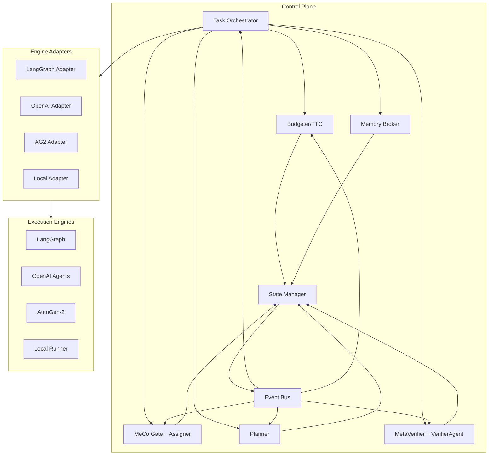
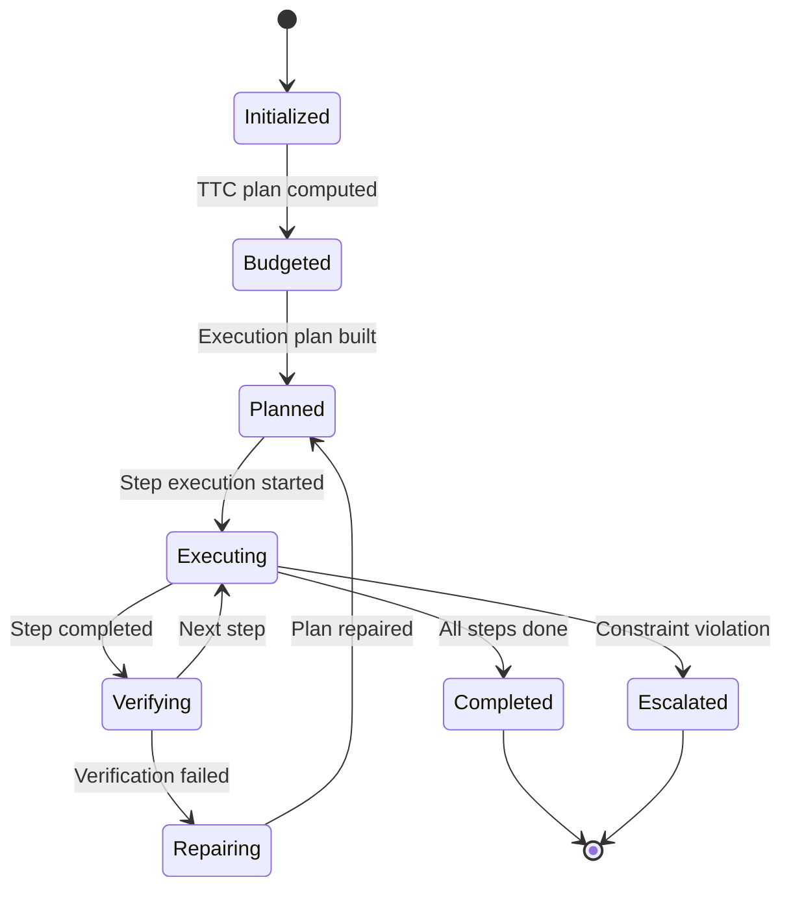

# Control Plane Specification — State Management & Coordination

## 1) Control Plane Overview

The **Control Plane** is the central orchestrator that hosts all five controllers and manages their coordination. It provides a unified interface for task execution while maintaining strict separation between ideology (our controllers) and execution engines (via adapters).

**Core Principle**: The Control Plane **never calls engines directly**—all execution goes through the **EngineAdapter** interface.

## 2) Architecture

### 2.1 Component Structure



### 2.2 State Management

**Shared State Schema**:
```python
class ControlPlaneState:
    # Task context
    task_id: str
    task_spec: TaskSpec
    status: TaskStatus
    
    # Budget tracking
    budget_consumed: Budget
    budget_remaining: Budget
    ttc_plan: TTCPlan
    
    # Execution state
    current_plan: GraphOfThought
    execution_step: int
    tool_calls: List[ToolCall]
    verification_results: List[VerificationResult]
    
    # Memory state
    episodic_memory: Dict[str, Any]
    semantic_context: List[MemoryItem]
    
    # Performance metrics
    start_time: datetime
    cost_accumulated: float
    latency_metrics: Dict[str, float]
```

## 3) Controller Integration

### 3.1 Task Orchestrator (Central Coordinator)

**Responsibilities**:
- Manage task lifecycle (start → execute → complete → cleanup)
- Enforce TaskSpec constraints and SLA policies
- Coordinate controller interactions
- Handle escalation and refusal decisions
- Collect receipts and produce final artifacts

**Interface**:
```python
class TaskOrchestrator:
    async def start_task(self, task_spec: TaskSpec) -> str:
        """Start a new task and return run_id"""
        
    async def execute_task(self, run_id: str) -> AsyncIterator[RunEvent]:
        """Execute task and yield events"""
        
    async def handle_escalation(self, run_id: str, issue: Issue) -> EscalationDecision:
        """Handle constraint violations"""
        
    async def complete_task(self, run_id: str) -> TaskResult:
        """Finalize task and produce artifact"""
```

### 3.2 Controller Communication

**Event-Driven Architecture**:
```python
class ControllerEvent:
    event_type: Literal["budget_update", "tool_selected", "plan_updated", "verification_result"]
    source_controller: str
    payload: Dict[str, Any]
    timestamp: datetime
    run_id: str

class EventBus:
    async def publish(self, event: ControllerEvent) -> None:
        """Publish event to all subscribers"""
        
    async def subscribe(self, controller: str, event_types: List[str]) -> AsyncIterator[ControllerEvent]:
        """Subscribe to events for a controller"""
```

**Controller Interfaces**:
```python
class Budgeter:
    async def compute_ttc_plan(self, task_spec: TaskSpec, current_state: ControlPlaneState) -> TTCPlan:
        """Compute TTC allocation"""
        
    async def update_budget(self, consumption: Budget, current_state: ControlPlaneState) -> BudgetUpdate:
        """Update budget based on consumption"""

class MeCoGate:
    async def should_use_tool(self, context: ExecutionContext) -> bool:
        """Decide if tool is needed"""
        
class Assigner:
    async def select_tools(self, requirements: ToolRequirements, available: List[ToolSpec]) -> List[ToolSpec]:
        """Select appropriate tools"""

class Planner:
    async def build_plan(self, goal: str, constraints: PlanningConstraints) -> GraphOfThought:
        """Build execution plan"""
        
    async def repair_plan(self, current_plan: GraphOfThought, feedback: ExecutionFeedback) -> GraphOfThought:
        """Repair plan based on feedback"""

class MetaVerifier:
    async def pre_verify(self, tool_spec: ToolSpec, args: Dict[str, Any]) -> VerificationResult:
        """Pre-call verification"""
        
    async def post_verify(self, tool_spec: ToolSpec, result: Any) -> VerificationResult:
        """Post-call verification"""

class VerifierAgent:
    async def verify_step(self, step_result: StepResult, contract: VerifyContract) -> VerificationResult:
        """Verify intermediate step"""
        
    async def verify_final(self, final_result: FinalResult, contract: VerifyContract) -> VerificationResult:
        """Verify final result"""
```

## 4) Execution Flow

### 4.1 Task Execution Sequence

```python
async def execute_task_flow(task_spec: TaskSpec) -> AsyncIterator[RunEvent]:
    # 1. Initialize state
    state = ControlPlaneState(task_spec=task_spec)
    
    # 2. Budgeter computes TTC plan
    ttc_plan = await budgeter.compute_ttc_plan(task_spec, state)
    state.ttc_plan = ttc_plan
    yield RunEvent(event="budget", payload=ttc_plan)
    
    # 3. MeCo Gate decides tool need
    tool_needed = await meco_gate.should_use_tool(context)
    
    # 4. Assigner selects tools if needed
    if tool_needed:
        tools = await assigner.select_tools(requirements, available_tools)
        state.selected_tools = tools
        yield RunEvent(event="tools_selected", payload=tools)
    
    # 5. Planner builds execution plan
    plan = await planner.build_plan(task_spec.goal, constraints)
    state.current_plan = plan
    yield RunEvent(event="plan_created", payload=plan)
    
    # 6. Execute plan steps
    for step in plan.steps:
        # Pre-verification
        pre_result = await meta_verifier.pre_verify(step.tool_spec, step.args)
        if not pre_result.passed:
            yield RunEvent(event="verification_failed", payload=pre_result)
            continue
            
        # Execute step via adapter
        step_result = await engine_adapter.execute_step(step)
        yield RunEvent(event="step_executed", payload=step_result)
        
        # Post-verification
        post_result = await meta_verifier.post_verify(step.tool_spec, step_result)
        if not post_result.passed:
            # Trigger reflection/repair
            repaired_plan = await planner.repair_plan(plan, post_result)
            state.current_plan = repaired_plan
            yield RunEvent(event="plan_repaired", payload=repaired_plan)
        
        # Update budget
        budget_update = await budgeter.update_budget(step_result.cost, state)
        state.budget_consumed += step_result.cost
        yield RunEvent(event="budget_updated", payload=budget_update)
    
    # 7. Final verification
    final_result = await verifier_agent.verify_final(result, task_spec.verify)
    yield RunEvent(event="verification_complete", payload=final_result)
    
    # 8. Complete task
    task_result = await task_orchestrator.complete_task(run_id)
    yield RunEvent(event="done", payload=task_result)
```

### 4.2 State Transitions



## 5) Memory Integration

### 5.1 Memory Broker Interface

```python
class MemoryBroker:
    async def store_episodic(self, run_id: str, event: RunEvent) -> None:
        """Store episodic memory"""
        
    async def retrieve_semantic(self, query: str, context: ExecutionContext) -> List[MemoryItem]:
        """Retrieve relevant semantic memory"""
        
    async def promote_to_semantic(self, episodic_items: List[EpisodicItem]) -> None:
        """Promote episodic items to semantic memory"""
        
    async def store_procedural(self, schema: ToolSpec, recipe: VerificationRecipe) -> None:
        """Store procedural memory"""
```

### 5.2 Memory Integration Points

- **Task Start**: Load relevant semantic context
- **Step Execution**: Store episodic traces
- **Verification**: Store reflection notes
- **Task Complete**: Promote important items to semantic memory
- **Tool Registration**: Store procedural schemas

## 6) Error Handling & Recovery

### 6.1 Error Classification

```python
class ErrorType(Enum):
    BUDGET_EXCEEDED = "budget_exceeded"
    TOOL_UNAVAILABLE = "tool_unavailable"
    PLAN_INFEASIBLE = "plan_infeasible"
    VERIFICATION_FAILED = "verification_failed"
    SLA_VIOLATED = "sla_violated"
    ENGINE_ERROR = "engine_error"

class ErrorHandler:
    async def handle_error(self, error: Error, state: ControlPlaneState) -> RecoveryAction:
        """Handle error and determine recovery action"""
```

### 6.2 Recovery Strategies

- **Retry**: For transient errors (network, rate limits)
- **Repair**: For verification failures (auto-repair, plan adjustment)
- **Refuse**: For constraint violations (budget, SLA)
- **Escalate**: For unresolvable issues (human intervention)

## 7) Performance & Scalability

### 7.1 Concurrency Model

- **Single Task**: Sequential controller coordination
- **Multiple Tasks**: Parallel execution with shared resources
- **Controller Scaling**: Horizontal scaling per controller type
- **Memory Scaling**: Distributed memory stores

### 7.2 Resource Management

```python
class ResourceManager:
    async def allocate_budget(self, task_id: str, budget: Budget) -> bool:
        """Allocate budget for task"""
        
    async def reserve_tools(self, task_id: str, tools: List[ToolSpec]) -> bool:
        """Reserve tools for task"""
        
    async def check_sla_compliance(self, task_id: str) -> SLAStatus:
        """Check SLA compliance"""
```

## 8) Observability

### 8.1 Metrics Collection

```python
class MetricsCollector:
    async def record_controller_metric(self, controller: str, metric: str, value: float) -> None:
        """Record controller-specific metric"""
        
    async def record_task_metric(self, task_id: str, metric: str, value: float) -> None:
        """Record task-specific metric"""
        
    async def record_cross_axis_metric(self, metric: str, value: float) -> None:
        """Record cross-axis metric"""
```

### 8.2 Tracing Integration

- **OpenTelemetry spans** for each controller interaction
- **Distributed tracing** across axes and adapters
- **Performance profiling** for bottleneck identification
- **Error tracking** with full context

## Acceptance & Traceability

**Acceptance**
- Control Plane coordinates all five axes without direct engine calls
- State management prevents race conditions and data corruption
- Error handling covers all failure modes with appropriate recovery
- Performance meets latency and throughput targets

**Traceability**
- This spec defines interfaces for: DOC-CTRL-BUDGETER, DOC-CTRL-MECO, DOC-CTRL-PLANNER, DOC-CTRL-MVR, DOC-CTRL-VERIFIER, DOC-CTRL-TASK-ORCH
- Memory integration references: DOC-MEM-BROKER
- Error handling connects to: DOC-SEC-INCIDENT
- Observability aligns with: DOC-OPS-OBS