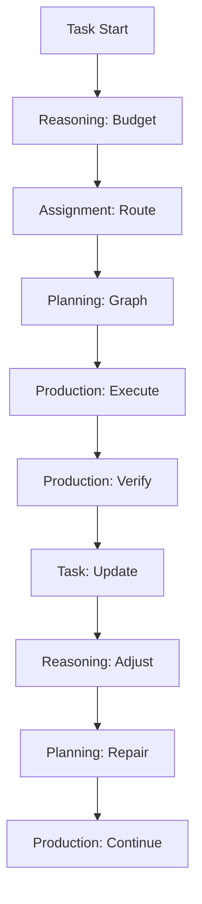

# Five-Axis Doctrine — Operational Rules & Responsibilities

## 1) Doctrine Overview

The AXIOM-25 Matrix operates on **five coordinated axes** that split reasoning and operational responsibilities. Each axis operates with autonomy but coordinates through shared state and explicit handoffs.

**Core Principle**: Each axis has **crisp responsibilities** and **clear interfaces** to other axes. No axis can violate another's domain; coordination happens through **explicit contracts**.

## 2) Axis Definitions

### 2.1 Reasoning Axis (Budgeter/TTC)

**Purpose**: Allocate and manage computational resources for thinking.

**Responsibilities**:
- Compute **depth** (reasoning steps), **width** (parallel branches), **reflection** (retry passes), **time** (hard caps)
- Implement **early-stop** when marginal gain < threshold
- Apply **TTC policies** (Plan-and-Budget, length control, adaptive reasoning)
- Enforce **SLA budgets** (tokens, time, cost)

**Inputs**:
- TaskSpec with budget constraints
- Uncertainty signals (logprob gaps, entropy)
- Historical cost data
- Policy bundle settings

**Outputs**:
- TTC plan (depth/width/reflection/time allocation)
- Early-stop signals
- Budget updates during execution

**Interfaces**:
- **To Planning**: Provides budget constraints for graph building
- **To Production**: Receives cost feedback for policy updates
- **To Tasks**: Enforces SLA compliance

### 2.2 Assignment Axis (MeCo Gate + Assigner)

**Purpose**: Decide who does what and when.

**Responsibilities**:
- **MeCo Gate**: Determine if tools/agents are needed (confidence-based gating)
- **Assigner**: Select appropriate tools/agents for the task
- Route actions to **LLM-only**, **tool-assisted**, or **delegated** execution
- Maintain **tool win-rates** and **capability profiles**

**Inputs**:
- Current confidence signals
- Available tool schemas
- Task requirements
- Historical performance data

**Outputs**:
- Routing decision (LLM/tool/delegate)
- Selected tool/agent list
- Risk assessment notes

**Interfaces**:
- **To Planning**: Provides routing constraints for plan building
- **To Production**: Receives tool performance feedback
- **To Tasks**: Validates tool allow-lists

### 2.3 Planning Axis (Planner)

**Purpose**: Build and maintain the execution plan.

**Responsibilities**:
- Create **Graph-of-Thought** (nodes = subgoals/tools, edges = dependencies)
- Schedule **search nodes** as first-class planning steps
- Score branches using **PRM/heuristics**
- Repair/repair plans based on execution feedback
- Prune weak branches under budget pressure

**Inputs**:
- Task goal and inputs
- Available tools (from Assignment)
- Budget constraints (from Reasoning)
- Search policies and PRM scorers

**Outputs**:
- Plan graph (nodes/edges with priorities)
- Search node schedules
- Branch scoring and pruning decisions

**Interfaces**:
- **To Reasoning**: Receives budget constraints
- **To Assignment**: Requests tool capabilities
- **To Production**: Provides execution plan
- **To Tasks**: Validates plan feasibility

### 2.4 Production Axis (MetaVerifier + VerifierAgent)

**Purpose**: Ensure reliable and verified execution.

**Responsibilities**:
- **MetaVerifier (MVR)**: Pre/post tool verification, auto-repair, reflection
- **VerifierAgent**: Unified verification for step/final outputs
- Apply **assertions** and **scorers** (PRM/heuristics)
- Handle **refusal** when confidence < threshold
- Generate **reflection notes** for learning

**Inputs**:
- Tool specs and arguments
- Execution results
- Verification contracts
- Assertion rules

**Outputs**:
- Verification verdicts (pass/fail/refuse)
- Auto-repair suggestions
- Reflection notes
- Receipts for audit

**Interfaces**:
- **To Planning**: Provides verification feedback for plan repair
- **To Assignment**: Reports tool reliability metrics
- **To Tasks**: Enforces verification contracts

### 2.5 Tasks Axis (Task Orchestrator)

**Purpose**: Manage task lifecycle and enforce contracts.

**Responsibilities**:
- Enforce **TaskSpec** constraints (allowed tools, budgets, verification)
- Manage task **lifecycle** (start → execute → complete → cleanup)
- Handle **escalation** and **refusal** when constraints violated
- Collect **receipts** and produce **final artifacts**
- Apply **SLA policies** and **risk controls**

**Inputs**:
- TaskSpec with all constraints
- Execution events and results
- Receipts from all axes

**Outputs**:
- Task status updates
- Final artifact with provenance
- SLA compliance reports
- Escalation/refusal decisions

**Interfaces**:
- **To All Axes**: Enforces contracts and collects receipts
- **To External**: Provides task status and final results

## 3) Coordination Rules

### 3.1 State Management

**Shared State**:
- Current task context
- Budget consumption
- Tool performance metrics
- Verification results
- Memory deltas

**State Updates**:
- Each axis can read shared state
- Updates must go through **Memory Broker**
- State changes trigger **event notifications**
- **Checkpointing** at major transitions

### 3.2 Event Flow



### 3.3 Decision Authority

**Budget Decisions**: Reasoning axis has final authority
**Tool Selection**: Assignment axis has final authority  
**Plan Structure**: Planning axis has final authority
**Verification**: Production axis has final authority
**Task Lifecycle**: Tasks axis has final authority

**Escalation Path**:
1. Axis detects constraint violation
2. Reports to Tasks axis
3. Tasks axis decides: continue/refuse/escalate
4. If escalate: human operator intervention

## 4) Policy Integration

### 4.1 Policy Bundle Structure

```yaml
# Example policy bundle
version: "2025.08.0"
profiles:
  tight-sla:
    reasoning:
      max_depth: 3
      max_width: 1
      max_reflections: 0
      early_stop_threshold: 0.1
    assignment:
      meco_threshold: 0.8
      tool_confidence_min: 0.9
    planning:
      search_trigger_threshold: 0.7
      branch_prune_threshold: 0.3
    production:
      verification_strict: true
      refusal_threshold: 0.8
    tasks:
      sla_timeout: 30s
      max_cost: 0.10
```

### 4.2 Policy Enforcement

- **Reasoning**: Applies TTC policies and budget caps
- **Assignment**: Uses confidence thresholds for gating
- **Planning**: Applies search and pruning policies
- **Production**: Uses verification and refusal thresholds
- **Tasks**: Enforces SLA and cost policies

## 5) Error Handling

### 5.1 Per-Axis Error Handling

**Reasoning**: Budget exceeded → early-stop, report to Tasks
**Assignment**: No suitable tools → escalate to human, report to Tasks
**Planning**: Plan infeasible → request budget increase, report to Tasks
**Production**: Verification failed → retry/repair, report to Tasks
**Tasks**: SLA violated → refuse task, notify operator

### 5.2 Cross-Axis Error Propagation

1. **Detection**: Axis detects error condition
2. **Classification**: Categorize as retry/repair/refuse/escalate
3. **Notification**: Report to Tasks axis and affected axes
4. **Response**: Execute error handling strategy
5. **Recovery**: Resume or terminate based on strategy

## 6) Performance Characteristics

### 6.1 Latency Budgets

- **Reasoning**: < 10ms for budget decisions
- **Assignment**: < 50ms for tool selection
- **Planning**: < 100ms for plan generation
- **Production**: < 200ms for verification
- **Tasks**: < 50ms for lifecycle management

### 6.2 Throughput Targets

- **Single Task**: All axes coordinate within SLA
- **Concurrent Tasks**: Axes scale horizontally
- **Memory Usage**: Bounded by task complexity
- **Tool Calls**: Rate-limited per tool and globally

## 7) Monitoring & Observability

### 7.1 Per-Axis Metrics

**Reasoning**: Budget utilization, early-stop rate, TTC efficiency
**Assignment**: Tool selection accuracy, MeCo gate effectiveness
**Planning**: Plan quality, search overhead, branch pruning rate
**Production**: Verification pass rate, auto-repair success, refusal rate
**Tasks**: SLA compliance, escalation rate, completion rate

### 7.2 Cross-Axis Metrics

- **End-to-end latency** (task start to completion)
- **Accuracy improvement** vs. baseline
- **Cost per solved task**
- **Tool error taxonomy**
- **Verification effectiveness**

## Acceptance & Traceability

**Acceptance**
- Each axis has clear, non-overlapping responsibilities
- Coordination rules prevent deadlocks and race conditions
- Policy enforcement is consistent across axes
- Error handling covers all failure modes

**Traceability**
- This doctrine defines interfaces for: DOC-CTRL-BUDGETER, DOC-CTRL-MECO, DOC-CTRL-PLANNER, DOC-CTRL-MVR, DOC-CTRL-VERIFIER, DOC-CTRL-TASK-ORCH
- Policy integration references: DOC-POLICY-BUNDLE
- Error handling connects to: DOC-SEC-INCIDENT
- Performance targets align with: DOC-OPS-OBS